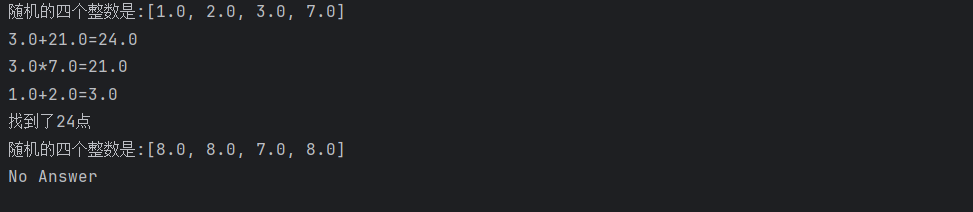

## 实验报告
### 实验目的
1. 通过递归打印文件夹中的全部文件。
2. 随机创建一个深度为10的树，并进行先序遍历。
3. 通过递归方法进行二分查找。
4. 解决24点问题。
### 实验内容
1. `W2Q1`类为通过递归方式打印文件夹中的全部文件。
2. `W2Q2`类为随机创建一个深度为10的树，并进行先序遍历的主类。
3. `W2Q3`类为通过递归方法进行二分查找。
4. `W2Q4`类为解决24点问题。
5. `CreateTree`类用于实现随机创建一个深度为10的树，并进行先序遍历。
6. `TreeNode`类用于定义一个树的节点，创建一个树。
#### 问题1
##### `W2Q1`类
```java
import java.io.File;

public class W2Q1 {
    public static void main(String[] args) {
        String folderPath = "D:\\高级程序设计";
        File directory = new File(folderPath);
        //调用printAllFiles方法打印文件夹下所有文件的绝对路径
        printAllFiles(directory);
    }
    /**
     * 打印文件夹下所有文件的绝对路径
     * @param directory 文件夹
     */
    public static void printAllFiles(File directory) {
        if(!directory.exists()){
            System.out.println("该文件地址不存在");
            return;
        }
        if(!directory.isDirectory()){
            System.out.println("文件:"+directory.getAbsolutePath());
            return;
        }
        File[] files = directory.listFiles();
        if(files==null){
            System.out.println("文件夹"+directory.getAbsolutePath()+"内容无法获取");
            return;
        }
        for(File file:files){
            if(file.isFile()){
                System.out.println("文件："+file.getAbsolutePath());
            }
            if(file.isDirectory()){
                System.out.println("进入文件夹"+file.getAbsolutePath()+"读取文件");
                //如果是文件夹，递归调用printAllFiles方法打印文件夹下所有文件的绝对路径
                printAllFiles(file);
            }
        }
    }
}
```
这个类中包含了一个`main`方法，用于测试`printAllFiles`方法。`printAllFiles`方法为通过递归方式打印文件夹中全部文件的主要方法。将文件夹内容为空与其形式为文件形式作为终止条件，  

运行结果：

#### 问题2
##### `W2Q2`类
```java
import java.util.ArrayList;
import java.util.Arrays;
import java.util.List;

public class W2Q2 {
    public static void main(String[] args) {
        //创建一个树
        CreateTree createTree = new CreateTree();
        //设置树的深度为10
        TreeNode node = createTree.treeCreate(10);
        //使用printTree方法打印树的结构
        System.out.println("\n树的结构 (简易打印):");
        printTree(node);
        //使用preorder方法和preorder2方法分别遍历树，将遍历结果存储到List中
        List<Double> nodes = new ArrayList<>();
        createTree.preorder(node, nodes);
        //使用preorder2方法遍历树，将遍历结果存储到List中
        List<Double> nodes1 = new ArrayList<>();
        createTree.preorder2(node, nodes1);
        //打印preorder和preorder2的遍历结果
        System.out.println("preorder遍历结果:");
        System.out.println(nodes.toString());
        //preorder2使用Morris遍历，可以在不增加时间复杂度的情况下降低空间复杂度
        System.out.println("preorder2遍历结果:");
        System.out.println(nodes1.toString());
        //将preorder的遍历结果转换为Double数组
        Double[] res = nodes.toArray(new Double[0]);
        System.out.println(Arrays.toString(res));
    }
}
```
该模块为该类中的main方法，通过调用针对问题2所创建的解决方法，实现随机创建一个深度为10的树，并进行先序遍历。
```java
/**
* 打印树的结构
* @param node 当前节点
* @param prefix 前缀，用于表示当前节点的位置,区分当前节点是左子节点还是右子节点以及层次
* @param isLeft 表示当前节点是否为左子节点
*/
public static void printTree(TreeNode node, String prefix, boolean isLeft) {
if (node == null) {
return;
}

        System.out.println(prefix + (isLeft ? "├── " : "└── ") + node.id);

        // 打印子节点时，需要根据当前节点的情况调整前缀
        // 如果有右子节点，左子树的连接线应该是'│'；否则是' '
        String childPrefix = prefix + (isLeft ? "│   " : "    ");

        // 递归打印，注意最后一个节点要用'└──'
        if (node.left != null || node.right != null) {
            printTree(node.left, childPrefix, true);
            printTree(node.right, childPrefix, false);
        }
    }

    // 一个方便调用的入口函数
    /**
     * 打印树的结构
     * @param root 根节点
     */
    public static void printTree(TreeNode root) {
        if (root == null) {
            System.out.println("树为空！");
            return;
        }
        System.out.println(root.id); // 先打印根节点
        printTree(root.left, "", true);
        printTree(root.right, "", false);
    }
```
这个模块为该类中的printTree方法，用于打印树的结构，为了方便调用，创建了一个入口函数。
###### `CreateTree`类
```java
import java.util.List;
import java.util.Random;
import java.util.concurrent.atomic.AtomicInteger;

public class CreateTree {
    private final Random rand = new Random(12);
    private final AtomicInteger atomicInteger = new AtomicInteger(0);

    public TreeNode treeCreate(int targetDepth) {
        TreeNode root = new TreeNode(0, 1);
        createMainLoop(targetDepth, root);
        createSubLoop(targetDepth, root, 0, 0.6);
        return root;
    }
}
```
`treeCreate`方法为创建树的主要方法，通过调用`createMainLoop`方法与`createSubLoop`方法完成确定深度的树的随机创建。

`createMainLoop`方法
```java
/**
     * 创建树的主干，确保树的深度达到我们的要求
     *@param targetDepth 为我们要求的树的深度
     *@param root 是我们创建的树的根节点
     */
    private void createMainLoop(int targetDepth,TreeNode root){
        int depth = 0;
        while (depth < targetDepth){
            if(rand.nextBoolean()){
                //通过随机数判断是否创建左子树，使用atomicInteger确保id的唯一性
                root.left = new TreeNode(atomicInteger.incrementAndGet(),rand.nextInt(100));
               //如果创建了左子树，将当前节点指向左子树
                root = root.left;
            }
            else{
                //通过随机数判断是否创建右子树，使用atomicInteger确保id的唯一性
                root.right = new TreeNode(atomicInteger.incrementAndGet(),rand.nextInt(100));
                root = root.right;
            }
            depth++;
        }
    }
```
`createMainLoop`方法为创建树的主要循环方法，通过随机数判断是否创建左子树或右子树，使用atomicInteger确保id的唯一性，同时更新当前节点的深度。

`createSubLoop`方法
```java
/**
 * 创建树的枝叶，确保树的每个节点都有左右子树
 * @param targetDepth 为我们要求的树的深度
 * @param root 是我们创建的树的根节点
 * @param depth 是当前节点的深度
 * @param p 是创建子树的概率
 */
private void createSubLoop(int targetDepth,TreeNode root,int depth,double p){
    //如果当前节点为空或者当前节点的深度已经达到了目标深度，直接返回
    if(root==null||depth>=targetDepth){
        return;
    }
    //如果当前节点的左子树为空，通过随机数判断是否创建左子树，使用atomicInteger确保id的唯一性
    if(root.left==null){
        root.left = rand.nextDouble()<p?new TreeNode(atomicInteger.incrementAndGet(),rand.nextInt(100)):null;
    }
    //如果当前节点的右子树为空，通过随机数判断是否创建右子树，使用atomicInteger确保id的唯一性
    if(root.right==null){
        root.right = rand.nextDouble()<p?new TreeNode(atomicInteger.incrementAndGet(),rand.nextInt(100)):null;
    }
    createSubLoop(targetDepth,root.left,depth+1,p);
    createSubLoop(targetDepth,root.right,depth+1,p);
}
```
`createSubLoop`方法为创建树的子节点循环方法，通过递归方式创建树的子节点，直到达到目标深度。

`preorder`方法
```java
/**
 * 前序遍历树，将树的节点值添加到List中
 * @param node 是当前遍历的节点
 * @param nodes 是存储节点值的List
 */
public void preorder(TreeNode node, List<Double> nodes) {
    if (node == null) {
        return;
    }
    nodes.add(node.val);
    preorder(node.left, nodes);
    preorder(node.right, nodes);
}
```
`preorder`方法通过递归方法前序遍历树，将树的节点值添加到List中。

`preorder2`方法
```java
/**
     * 改写Morris前序遍历方法，使其适用于先序遍历
     * @param node 是当前遍历的节点
     * @param nodes 是存储节点值的List
     */
    public void preorder2(TreeNode node, List<Double> nodes) {
        while (node != null) {
            if (node.left != null) {
                TreeNode temp = node.left;
                //如果当前节点的左子树不为空，找到左子树的最右节点
                //如果最右节点的右指针为空，将最右节点的右指针指向当前节点，将当前节点指向左子树

                while (temp.right!=null&&temp.right!=node){
                    temp = temp.right;
                }
                if (temp.right==null){
                    //如果最右节点的右子节点为空，说明该节点是第一次遍历到，将当前节点的值添加到List中
                    nodes.add(node.val);
                    temp.right = node;
                    node = node.left;
                }
                //如果最右节点的右指针指向当前节点，说明左子树已经遍历完，将最右节点的右指针指向空，将当前节点指向右子树
                else{
                    temp.right = null;
                    node = node.right;
                }
            }
            //如果当前节点的左子树为空，将当前节点的值添加到List中，将当前节点指向右子树
            else {
                //确保在第一次遍历到当前节点时，将当前节点的值添加到List中
                nodes.add(node.val);
                node = node.right;
            }
        }


    }
```
`preorder2`方法为改写Morris前序遍历方法，使其适用于先序遍历，通过将当前节点的左子树的最右节点的右指针指向当前节点，实现遍历完左子树后能够回到当前节点的效果。   
通过对每个节点遍历两次，使其时间复杂度仍然是O(N),而空间复杂度从O(N)降低到O(1);

##### `TreeNode` 类
```java
/**
 * 树的节点类，每个节点包含一个值和左右子节点的引用
 */
public class TreeNode {
    int id;
    double val;
    TreeNode left;
    TreeNode right;
    public TreeNode(int id,double val){
        this.id = id;
        this.val = val;
    }
}
```
`TreeNode` 类是树的节点类，每个节点包含一个值和左右子节点的引用。  
运行结果：

#### 问题3
##### `W2Q3`类
```java
public class W2Q3 {
    public static void main(String[] args) {
        int[] nums = new int[]{1,2,3,4,5,6,7,8,9,10};
        int k = 9;
        int left = 0;
        int right = nums.length - 1;
        int res = solution(left,right,k,nums);
        if(res==-1) {
            System.out.println("该元素在数组中未找到");
        }
        else{
        System.out.println(k+"在数组中的索引是"+res);}
    }
    /**
     * 查找数组中是否存在目标元素，如果存在返回元素的索引，否则返回-1
     * @param left 左边界
     * @param right 右边界
     * @param num 目标元素
     * @param nums 数组
     * @return 目标元素的索引
     */
    private static int solution(int left,int right,int num,int[] nums) {
        if(left > right){
            return -1;
        }
        int mid = (left + right) / 2;
        if (nums[mid] < num) {
            left = mid + 1;
        }
        else if (nums[mid] > num) {
            right = mid - 1;
            }
        else {
            return mid;
            }
        return solution(left,right,num,nums);
    }
}
```
`W2Q3`类为查找数组中是否存在目标元素的类，通过递归方式实现二分查找。
运行结果：

#### 问题4
##### `W2Q4`类
```java
import java.util.ArrayList;
import java.util.Random;

public class W2Q4 {
    public static void main(String[] args) {
        Random rand = new Random();
        Double m1 = (double)rand.nextInt(1,10);
        Double m2 = (double)rand.nextInt(1,10);
        Double m3 = (double)rand.nextInt(1,10);
        Double m4 = (double)rand.nextInt(1,10);
        ArrayList<Double> test= new ArrayList<>();
        test.add(m1);
        test.add(m2);
        test.add(m3);
        test.add(m4);//随机案例
        ArrayList<Double> nums= new ArrayList<>();
        nums.add(1.0);
        nums.add(2.0);
        nums.add(3.0);
        nums.add(7.0);//成功案例
        point24(nums);
        point24(test);
    }

    /**
     * 解决24点问题的主要方法
     * @param nums 进行计算的数字，初始时刻为输入的四个数字，后续随着回溯递归而减少
     * @return 如果能够通过加减乘除得到24点，返回true；否则返回false
     */
    private static boolean solution(ArrayList<Double> nums) {
        //安全检查
        if (nums.isEmpty()) {return false;}
        //结果判断：如果只有一个数字，检查它是否等于24
        if (nums.size() == 1) {
            return Math.abs(nums.getFirst() - 24.0) < 1e-6;
        }
        for (int i = 0; i < nums.size(); i++) {
            for (int j = i + 1; j < nums.size(); j++) {
                //选择两个数字进行计算
                Double num1 = nums.get(i);
                Double num2 = nums.get(j);
                ArrayList<Double> list = new ArrayList<>();
                for (int k = 0; k < nums.size(); k++) {
                    //将除了选中的两个数字外的其他数字加入新列表
                    if(k!=i && k!=j){
                        list.add(nums.get(k));
                    }
                }
                //将两个数字的加减乘除结果加入新列表
                list.add(num1+num2);
                //递归调用解决新列表
                if (solution(list)) {
                    System.out.println(num1+"+"+num2+"="+(num1+num2));
                    return true;}
                //去除列表中最后一个元素（即刚刚加入的加法结果），进行回溯
                list.removeLast();
                //开始减法运算
                list.add(num1-num2);
                if (solution(list)) {
                    System.out.println(num1+"-"+num2+"="+(num1-num2));
                    return true;}
                list.removeLast();
                //尝试另一种减法
                list.add(num2-num1);
                if (solution(list)) {
                    System.out.println(num2+"-"+num1+"="+(num1-num2));
                    return true;}
                list.removeLast();
                list.add(num1*num2);
                if (solution(list)) {
                    System.out.println(num1+"*"+num2+"="+(num1*num2));
                    return true;}
                list.removeLast();
                //避免除数为0的情况
                if(num2!=0){
                list.add(num1/num2);
                if (solution(list)) {
                    System.out.println(num1+"/"+num2+"="+(num1/num2));
                    return true;}
                list.removeLast();}
                if (num1!=0) {
                    list.add(num2/num1);
                    if(solution(list)){
                        System.out.println(num2+"/"+num1+"="+(num2/num1));
                        return true;}
                    list.removeLast();
                }
            }
        }

    return false;
    }
    /**
     * 打印24点的计算过程
     * @param nums 进行计算的数字，初始时刻为输入的四个数字
     */
    private  static void point24(ArrayList<Double> nums){
        System.out.println("随机的四个整数是:"+nums.toString());
        if (solution(nums)) {
            System.out.println("找到了24点");
        }
        else{
            System.out.println("No Answer");
        }
    }
}
```
`W2Q4`类为解决24点问题的类，通过递归方式实现回溯搜索。
运行结果：

